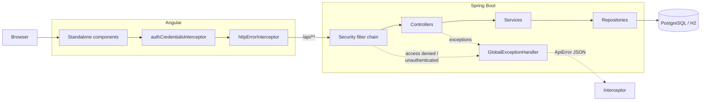
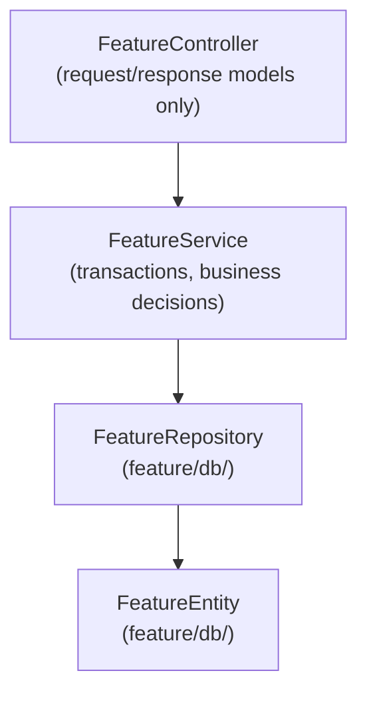
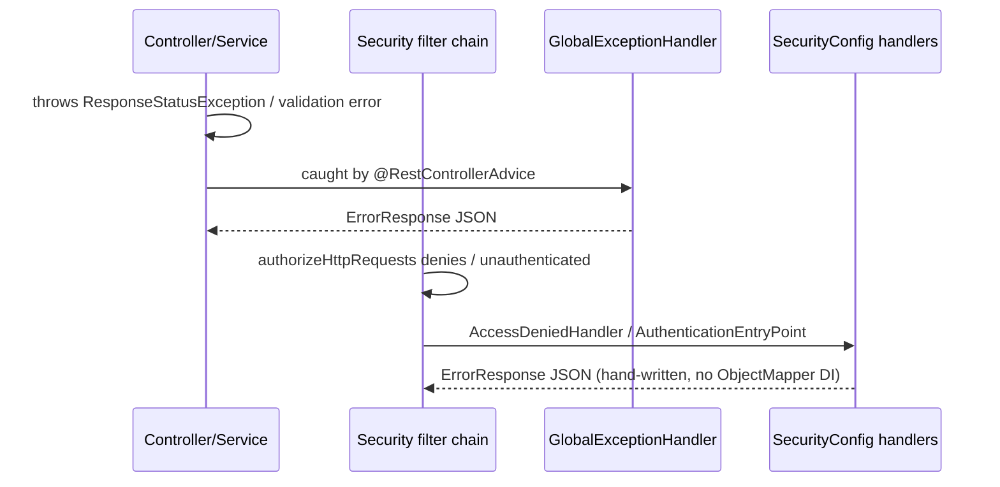
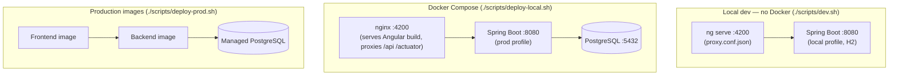

# Architecture

This project is a two-part application: an Angular frontend and a Spring
Boot backend, talking over a REST API the backend owns.



Backend responsibilities: business rules, security, persistence, and
feature enforcement. Flyway owns schema migrations. PostgreSQL is the
production/Docker database; H2 is for quick local backend-only runs (see
`docs/KNOWN_LIMITATIONS.md` for where the two diverge).

## Backend

Use feature packages under the Java package root. A typical backend
feature looks like:

```text
feature/
  FeatureController.java
  FeatureService.java
  db/
    FeatureRepository.java
    FeatureEntity.java
  model/
    FeatureResponse.java
  types/
    FeatureStatus.java
```



Rules:

- Controllers expose request/response models only, never JPA entities.
- Controllers call services only, never repositories directly.
- Services own transactions and business decisions.
- Repositories and entities are persistence details, isolated under `feature/db/`.
- Feature enums live under `feature/types/`.
- Database schema changes go through Flyway migrations.

Full rule list: `docs/CONVENTIONS.md`.

### Error Handling

One shape, two producers. `GlobalExceptionHandler` (`@RestControllerAdvice`)
handles exceptions Spring MVC's dispatch can catch — business logic,
`ResponseStatusException`, validation, method-level `@PreAuthorize`.
Exceptions the security filter chain throws itself (URL-level
`authorizeHttpRequests` rules, authentication failures) never reach it,
because they happen before `DispatcherServlet` runs — those are handled
directly in `SecurityConfig`'s `AccessDeniedHandler` /
`AuthenticationEntryPoint`. Both paths produce the same JSON shape.



See `docs/DECISIONS.md` ("Centralize Exception Handling") for why the
`SecurityConfig` handlers write JSON by hand instead of injecting
`ObjectMapper` — this app has two incompatible Jackson major versions on
the classpath at once, and the security layer shouldn't depend on either.

## Frontend

Use standalone Angular features with lazy routes.

```text
src/app/
  core/       app-wide services, API clients, auth, error handling
  features/   route-level features
  layout/     shell/navigation
  shared/     reusable presentational components
```

Rules:

- Prefer standalone components.
- Prefer typed services and the generated API client (`core/api/`).
- Keep backend contract assumptions out of components.
- Handle loading and error states explicitly.

### HTTP Error Handling

`core/auth-credentials.interceptor.ts` attaches the in-memory Basic
authorization header from the shell login form to `/api/**` requests.
`core/error/http-error.interceptor.ts` is the one place every HTTP error gets
normalized into `ApiError` (`core/error/api-error.ts`) and logged. It rethrows
rather than swallowing the error, so components still render their own
loading/error state — see `AdminComponent`, which shows the backend's real
message via `catchError`.

## Cross-Cutting

OpenAPI is the source of truth for the frontend/backend API contract.
`./scripts/generate-api.sh` regenerates the committed Angular client under
`frontend/src/app/core/api` from the backend's `/v3/api-docs`. See
`docs/API_CONTRACT.md` for the workflow and the error response shape.

## Deployment Topology



Three ways to run the app locally, matched to what you're doing:

| Mode                          | Command                        | Database               |
| ----------------------------- | ------------------------------ | ---------------------- |
| Backend + frontend, no Docker | `./scripts/dev.sh`             | H2 (in-memory)         |
| Full stack, Docker            | `./scripts/deploy-local.sh up` | PostgreSQL (container) |
| Production-like, Docker       | `docker compose up --build`    | PostgreSQL (container) |

## Keeping This Document Current

Update this file (prose and diagrams) whenever a change alters request
flow, package structure, error handling, or deployment topology — the
same trigger `AGENTS.md` already names for architecture-affecting changes.
Small diagrams that stay accurate beat comprehensive ones that drift;
prefer editing an existing diagram over leaving it stale.
